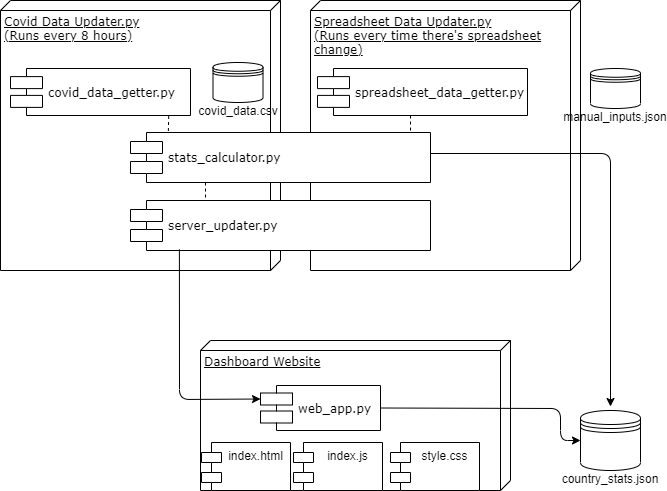

# Return to field work dashboard

Website that present IPA country status for returning to field work.

The system has 3 main components:

* A website that presents the dashboard based on already computed country_stats.json
* A process that collects covid data every 8 hours and re computes country_stats.json
* A process that captures changes in a spreadsheet where users can input data which overrides country_stats.json

## System overview



### covid data updater

Every 8 hours:

Scheduler will run country_stats_updater.update_for_new_covid_data()

Internally, this will call:

- covid_data_getter.download_covid_data()
- stats_calculator.compute_country_stats()
- update_web_server_country_stats()

### spreadsheet data updater

Whenever there is a change in [this](https://docs.google.com/spreadsheets/d/1xvFTrmbjrJbYDHKej_AsEcCWEwsM7JCGxCdzYPZRQgk/edit#gid=1855212233) spreadsheet, aka, someone manually wrote information, we will trigget a call to country_stats_updater.update_for_spreadsheet_data()

Internally, this will call:

- spreadsheet_data_getter.download_spreadsheet_data()
- stats_calculator.compute_country_stats()
- update_web_server_country_stats()

## Setup

### Setting up aws server

Log in to aws console and launch an ubuntu ec2 instance

Copy google sheets secret key to server, which will allow the system to query g sheets
[Only once]

`scp -i credentials/aws-key-pair.pem client_secret.json ubuntu@ec2-18-217-4-44.us-east-2.compute.amazonaws.com:/home/ubuntu`

Changing permissions on .pem file
[Only once]

`chmod 400 credentials/aws-key-pair.pem`

ssh to ec2 instance

`ssh -i credentials/aws-key-pair.pem ubuntu@ec2-18-217-4-44.us-east-2.compute.amazonaws.com`

Install dependencies in server
[Only once]

`sudo apt update`

`sudo apt install python3-pip`

`sudo apt-get install python3-venv`

`sudo apt install tmux`

Clone repo, create virtual environment
[Only once]
`github clone https://github.com/PovertyAction/return-to-fieldwork-dashboard.git`

`python3 -m venv venv`

Activate venv and install project dependencies

`source venv/bin/activate`

`pip3 install -r requirements.txt`

### Setting up sessions for each component using tmux

To list tmux sessions:

`tmux ls`

To log in (attach) to a tmux session:

`tmux attach-session -t session_name`	

#### web app

To deploying web app in production, follow step by step of this tutorial:
https://medium.com/faun/deploy-flask-app-with-nginx-using-gunicorn-7fda4f50066a
(There might be some little things missing, check questions in tutorial)
[Only once]

To restart web server every time we've made updates:

`sudo systemctl restart nginx`

Enable HTTP calls in aws security group associated to this instance.

For development:

Crete web app tmux session if it doesnt exist.
[Only once]

`tmux new -s web_app`

If it already doest, attach to it:

`tmux attach-session -t web_app`

Launch web app

`python3 web_app.py`

#### spreadsheet data updater

Create tmux session
[Only once]

`tmux new -s spreadsheet_data_updater`

Launch spreadsheet data updater

`python3 spreadsheet_data_updater.py`

Remember to enable TCP calls from anywhere to port 5002 (which is the one spreadsheed_data_updater.py uses) in aws security group associated to this instance.
Rule: Custom TCP TCP 5002 Anywhere

#### covid data updater

Setup [cron](https://opensource.com/article/17/11/how-use-cron-linux) to run `covid_data_updater.py` every 8 hours and keep log in `covid_data_updater_log.txt`

```
crontab -e
#Write down in the end of the crontab file the following line:
0 */8 * * * /usr/bin/python3 /home/ubuntu/return-to-fieldwork-dashboard/covid_data_updater.py >> /home/ubuntu/return-to-fieldwork-dashboard/covid_data_updater_log.txt
```
You can check what has crontab run with:
```
tail /var/log/syslog
```
Remember to use absolute routes


## Calculation steps
<!-- https://www.codecogs.com/latex/eqneditor.php -->

### Data source
The [data](https://github.com/owid/covid-19-data/tree/master/public/data) compiled by [Our World in Data (OWD)](https://ourworldindata.org/covid-cases) is used for the calculations. The data can be downloaded from [here](https://covid.ourworldindata.org/data/owid-covid-data.csv). To learn more about the variables used for the calculations, please read the [codebook](https://github.com/owid/covid-19-data/blob/master/public/data/owid-covid-codebook.csv).


### New cases per day
Variable ``new_cases`` is used to calculate the last _3 days average_ of new cases per day. 

### Case doubling rate
Doubling rate extrapolated from the week-over-week change in new cases. Case doubling rate is calculated using the following formula and expressed in number of _days_:

<p style="text-align:center"><a href="https://www.codecogs.com/eqnedit.php?latex=\bg_white&space;Case\&space;doubling\&space;rate&space;=&space;\cfrac&space;{ln(2)}&space;{ln(1&plus;\cfrac&space;{growthrate}&space;{100})}" target="_blank"></a></p>

<p style="text-align:center"><a href="https://www.codecogs.com/eqnedit.php?latex=\bg_white&space;growthrate&space;=&space;\cfrac&space;{Average\&space;new\&space;cases\&space;in\&space;last\&space;7\&space;days&space;-&space;Average\&space;new\&space;cases\&space;in\&space;previous\&space;7\&space;days}&space;{Average\&space;new\&space;cases\&space;in\&space;previous\&space;7\&space;days}" target="_blank"></a></p>

Case doubling rate is marked as __>100__ if the rate is either _more than 100 days_ or _negative_. Case doubling rate __Not Applicable (N/A)__ means there were no new cases and thus the case doubling rate is 0.

### Cases per 100,000 people
Variables ``total_cases`` and ``population`` were used to calculate cases per 100,000 people.

<p style="text-align:center"><a href="https://www.codecogs.com/eqnedit.php?latex=\bg_white&space;Cases\&space;per\&space;100,000\&space;people&space;=&space;\cfrac&space;{total\_cases*100000}&space;{population}" target="_blank"></a></p>

### Positivity rate
Variable ``positive_rate`` was used.